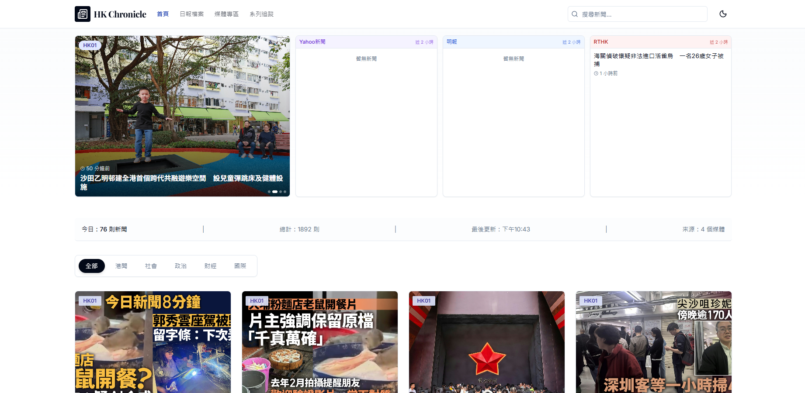
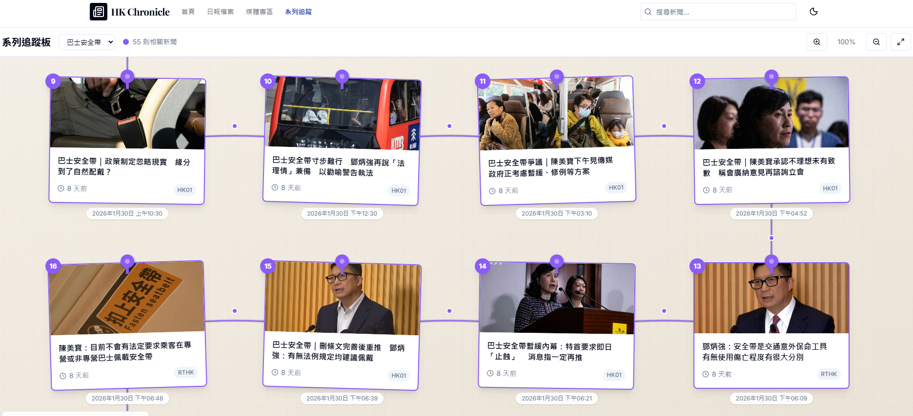
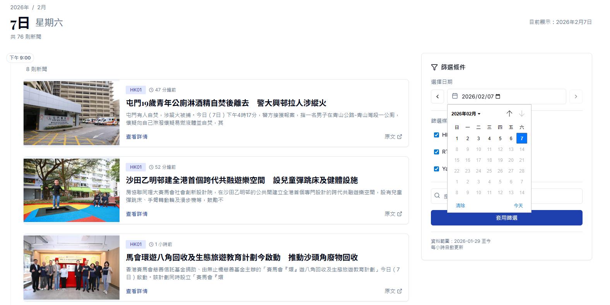
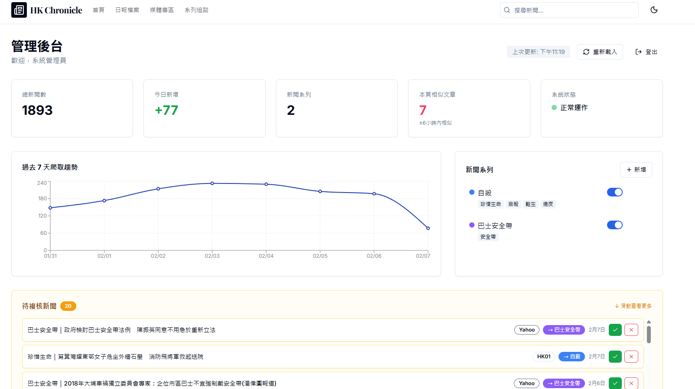
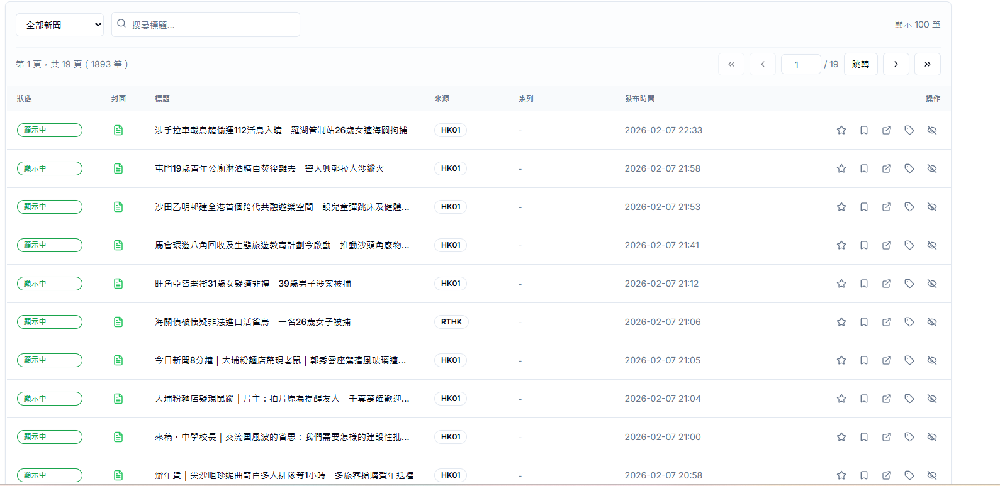

<div align="center">

# 📰 HK Chronicle 香港新聞編年史 http://hk-annals.vercel.app

**一站式香港新聞聚合平台 | 多源即時資訊 | 智能去重演算法**

[](https://hk-annals.vercel.app)

[](https://react.dev/)
[](https://www.typescriptlang.org/)
[](https://vitejs.dev/)
[](https://turso.tech/)
[](https://github.com/features/actions)

[English](#english) | [功能特色](#-功能特色) | [技術架構](#-技術架構) | [快速開始](#-快速開始)

</div>

---

## 📋 專案簡介

**HK Chronicle** 是一個現代化的香港新聞聚合平台，自動從多個主流媒體來源擷取新聞，提供統一的閱讀體驗。系統採用智能去重演算法，過濾重複報導，讓讀者快速掌握香港時事動態。

### 🎯 專案目標

- 整合香港主要新聞來源，提供一站式閱讀體驗
- 自動化新聞擷取，每小時更新
- 智能識別相似新聞，減少資訊重複
- 支援新聞系列追蹤，視覺化呈現議題發展脈絡

---

## ✨ 功能特色

### 📱 前端功能

| 功能 | 描述 |
|------|------|
| **即時新聞首頁** | 聚合顯示最新新聞，支援分類篩選（港聞、財經、國際等） |
| **多源輪播 Banner** | HK01 輪播 + Yahoo/明報/RTHK 即時新聞欄位 |
| **日報檔案** | 按日期瀏覽歷史新聞，支援日曆選擇 |
| **媒體專區** | 按媒體來源瀏覽新聞，了解各媒體報導風格 |
| **系列追蹤板** | 偵探板風格視覺化，追蹤特定議題的新聞脈絡 |
| **深色模式** | 支援淺色/深色主題切換 |
| **響應式設計** | 完美適配桌面、平板、手機 |

### ⚙️ 後端功能

| 功能 | 描述 |
|------|------|
| **多源爬蟲** | 支援 HK01、Yahoo新聞、明報、RTHK 四大來源 |
| **自動排程** | GitHub Actions 每小時自動執行爬蟲 |
| **智能去重** | 65% 相似度閾值過濾重複新聞 |
| **新聞群組** | 自動將相同事件的不同報導歸類 |
| **管理後台** | 新聞管理、系列建立、停用/恢復功能 |

---

## 🖼️ 系統截圖

<div align="center">

### 首頁 - 新聞聚合
*多源新聞即時更新，分類篩選一目了然*




### 系列追蹤板 - 偵探板風格 - 自動化整理
*視覺化追蹤議題發展，串連新聞脈絡，透過關鍵字實現全自動化追蹤*



### 日報檔案
*按日期瀏覽歷史新聞*



### 管理後台
*新聞管理、系列建立、審核功能*





</div>

---

## 🛠️ 技術架構

```
HK_annals/
├── src/                          # 前端源碼 (React + TypeScript)
│   ├── components/               # UI 組件
│   │   ├── ui/                   # 基礎 UI 元件
│   │   ├── HeroCarousel.tsx      # 首頁輪播
│   │   ├── Layout.tsx            # 頁面佈局
│   │   └── NewsCard.tsx          # 新聞卡片
│   ├── pages/                    # 頁面組件
│   │   ├── Home.tsx              # 首頁
│   │   ├── DailyArchive.tsx      # 日報檔案
│   │   ├── MediaPage.tsx         # 媒體專區
│   │   ├── SeriesBoard.tsx       # 系列追蹤板
│   │   ├── NewsDetail.tsx        # 新聞詳情
│   │   ├── AdminDashboard.tsx    # 管理後台
│   │   └── AdminLogin.tsx        # 管理員登入
│   └── lib/                      # 工具函數與 API
│
├── server/                       # 後端程式碼
│   ├── scrapers/                 # 新聞爬蟲
│   │   ├── hk01.ts               # HK01 爬蟲
│   │   ├── yahoo.ts              # Yahoo 新聞爬蟲
│   │   ├── mingpao.ts            # 明報爬蟲
│   │   ├── rthk.ts               # RTHK 爬蟲
│   │   └── index.ts              # 爬蟲入口
│   ├── db/                       # 資料庫
│   │   ├── client.ts             # Turso 客戶端
│   │   └── init-db.ts            # 初始化腳本
│   ├── lib/                      # 後端工具
│   │   └── dedup.ts              # 去重演算法
│   └── migrations/               # 資料庫遷移
│
├── scripts/                      # 開發/調試腳本
└── .github/workflows/            # GitHub Actions 自動化
```

### 技術堆疊

| 層級 | 技術 |
|------|------|
| **前端框架** | React 19 + TypeScript |
| **建構工具** | Vite 6 |
| **樣式方案** | Tailwind CSS |
| **路由** | React Router 7 |
| **圖表** | Recharts |
| **圖示** | Lucide React |
| **資料庫** | Turso (LibSQL - 邊緣 SQLite) |
| **自動化** | GitHub Actions |
| **部署** | 靜態網站 (可部署至任何平台) |

---

## 🚀 快速開始

### 環境需求

- Node.js 18+
- npm 或 yarn
- Turso 帳號 (免費方案即可)

### 安裝步驟

```bash
# 1. 克隆專案
git clone https://github.com/simonhkg2002/HK_annals.git
cd HK_annals

# 2. 安裝依賴
npm install

# 3. 設定環境變數
cp .env.example .env
# 編輯 .env 填入 Turso 憑證

# 4. 初始化資料庫
npm run db:init

# 5. 執行開發伺服器
npm run dev
```

### 環境變數

```env
# Turso 資料庫
TURSO_DATABASE_URL=libsql://your-db.turso.io
TURSO_AUTH_TOKEN=your-auth-token

# 前端使用 (Vite)
VITE_TURSO_DATABASE_URL=libsql://your-db.turso.io
VITE_TURSO_AUTH_TOKEN=your-auth-token
```

### 可用指令

```bash
# 開發
npm run dev              # 啟動開發伺服器
npm run build            # 建構生產版本
npm run preview          # 預覽生產版本

# 爬蟲
npm run scrape:hk01:full     # 執行 HK01 爬蟲
npm run scrape:yahoo:full    # 執行 Yahoo 爬蟲
npm run scrape:mingpao:full  # 執行明報爬蟲
npm run scrape:rthk:save     # 執行 RTHK 爬蟲

# 資料庫
npm run db:init          # 初始化資料庫
```

---

## 📊 系統特點

### 智能去重演算法

系統採用多層次去重策略，有效過濾重複新聞：

1. **URL 精確比對** - 完全相同的新聞來源
2. **內容雜湊比對** - 偵測相同內容的不同來源
3. **標題相似度計算** - 65% 閾值識別相似報導
4. **新聞群組歸類** - 將相同事件的報導自動歸組

### 自動化工作流程

```yaml
# GitHub Actions 每小時自動執行
schedule:
  - cron: '0 * * * *'  # 每小時整點

# 執行順序
1. HK01 爬蟲 → 2. Yahoo 爬蟲 → 3. RTHK 爬蟲 → 4. 明報爬蟲
```

---

## 🗄️ 資料庫結構

```sql
-- 主要資料表
├── articles          # 新聞文章 (主表)
├── media_sources     # 媒體來源
├── categories        # 新聞分類
├── news_series       # 新聞系列
├── news_clusters     # 新聞群組 (相似新聞)
├── admin_users       # 管理員帳號
└── scraper_logs      # 爬蟲執行記錄
```

---

## 🔮 未來規劃

- [ ] 新增更多新聞來源 (如：星島、經濟日報)
- [ ] AI 摘要功能 (使用 Gemini API)
- [ ] 新聞情感分析
- [ ] 訂閱通知功能
- [ ] PWA 支援

---

## 📄 授權

MIT License - 歡迎自由使用與修改

---

<div align="center">

## English

**HK Chronicle** is a modern Hong Kong news aggregation platform that automatically collects news from multiple mainstream media sources, providing a unified reading experience with intelligent deduplication.

### Key Features
- Multi-source news aggregation (HK01, Yahoo News, Ming Pao, RTHK)
- Automated hourly scraping via GitHub Actions
- Smart deduplication algorithm (65% similarity threshold)
- Series tracking board with detective-board style visualization
- Admin dashboard for content management
- Responsive design with dark mode support

### Tech Stack
React 19 • TypeScript • Vite • Tailwind CSS • Turso (SQLite) • GitHub Actions

---

**Built with ❤️ in Hong Kong**

</div>
